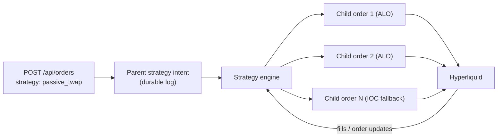

## Async-accept: what a 200 means

`POST /api/orders` returns `200` when your order (or strategy) is **accepted into the execution engine** — *not* when it fills.

- For a **plain order**, `orderId` is the venue order ID and the order is live on Hyperliquid.
- For an **algo strategy** (`strategy` set), `orderId` is the **parent strategy ID**. Fills arrive asynchronously as the engine works the order; track progress via [`GET /api/orders/algo`](/guides/algo-orders) or the [algo status WebSocket](/websockets/algo-status).

```json
{
  "success": true,
  "orderId": "01HZX…",
  "status": "accepted",
  "provider": "hyperliquid"
}
```

## Parents and children

An algo order is a **parent intent** that the strategy engine decomposes into **child orders** on the venue:



Key properties:

- **Durability first.** The parent intent is persisted to a durable log *before* execution starts. If the engine restarts mid-strategy, it replays non-terminal intents, reconciles them against Hyperliquid's actual open orders and fills (child orders carry deterministic client order IDs derived from the parent), and resumes. Recovery is fail-closed: if active intents can't be reconciled against the venue, the server won't serve traffic with unknown state.
- **The venue is the source of truth.** Quote's database is a read projection. Fill and order state ultimately comes from Hyperliquid.
- **Strategies decide when they're done.** A strategy reaches a terminal state (`completed`, `cancelled`, `failed`) only when its own logic says so and the venue state agrees.

## Cancellation semantics

Cancelling an algo parent is a **request**, not an instant state change:

<Steps>
  <Step title="Cancel accepted">
    `POST /api/orders/cancel` with the parent `orderId` returns `200` once the cancel request is durably recorded. The engine stops scheduling new strategy work immediately.
  </Step>
  <Step title="Children reconciled">
    The engine cancels the strategy's open child orders on Hyperliquid and confirms none remain open. Fills that landed before cancellation are, of course, yours.
  </Step>
  <Step title="Terminal state recorded">
    Only after no known child order remains open does the strategy record terminal `cancelled`.
  </Step>
</Steps>

<Warning>
  Parent-cancel HTTP success means the cancel was **durably accepted** — not that the strategy is already terminal. Poll `GET /api/orders/algo/{order_id}` (or watch the WebSocket) if you need to confirm the terminal state before, say, submitting a replacement order.
</Warning>

Plain (non-algo) orders cancel synchronously — `200` means the venue confirmed the cancel.

## Order statuses

| Status | Meaning |
|---|---|
| `accepted` / working | The engine is actively executing the strategy |
| `completed` | Full size executed |
| `cancelled` | Cancel requested and all children reconciled closed |
| `failed` | The strategy hit an unrecoverable error; remaining size was not executed |

`filledQty` on the algo order tells you how much of `orderQty` executed, whatever the terminal state.
