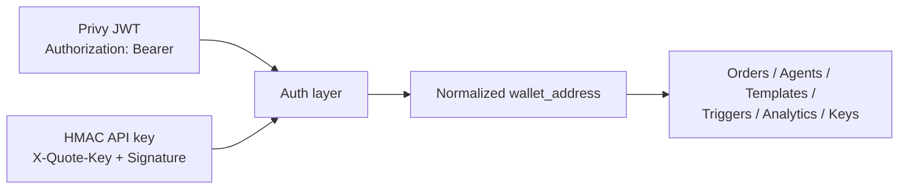

Quote's API is **wallet-scoped**: the unit of ownership for everything is a normalized EVM wallet address.

- Agent wallets, orders, strategies, templates, triggers, API keys, invites, and analytics are all keyed by wallet.
- The auth layer resolves your credential (Privy token or HMAC key) to a wallet address before any handler runs.
- Handlers **never** read a wallet address from a request body or query string. There is nothing to pass — and nothing to spoof.

## What this means in practice

**You never specify who you are.** Endpoints that look account-shaped (`GET /api/orders/algo`, `GET /api/funding`, `GET /api/portfolio/equity`) take no wallet parameter; they operate on the authenticated wallet automatically.

**Resources you don't own are invisible.** Fetching another wallet's template or trigger by UUID returns `404`, not `403` — ownership is part of resource identity.

**One wallet, many credentials.** A Privy session and any number of API keys minted from it all resolve to the same wallet and see the same account. Revoking a key doesn't affect the others.

**Analytics are per-wallet.** Execution quality, volume, fees, funding, and equity time-series all answer for *your* wallet only. The [MCP connector](/guides/mcp-connector) follows the same rule: an `account:read` token only ever sees the account it was issued for.

## Identity resolution

Both auth paths converge on the same normalized `wallet_address`; see [Authentication](/authentication) for the mechanics of each.

## Trading identity vs. auth identity

The wallet address from your credential is your **master account** on Hyperliquid. Orders are not signed by that wallet directly — they're signed by its registered [agent wallet](/concepts/agent-wallets), which Quote resolves per-wallet at signing time and verifies against Hyperliquid (`userRole(agent).data.user` must equal your wallet) immediately before every signature.
