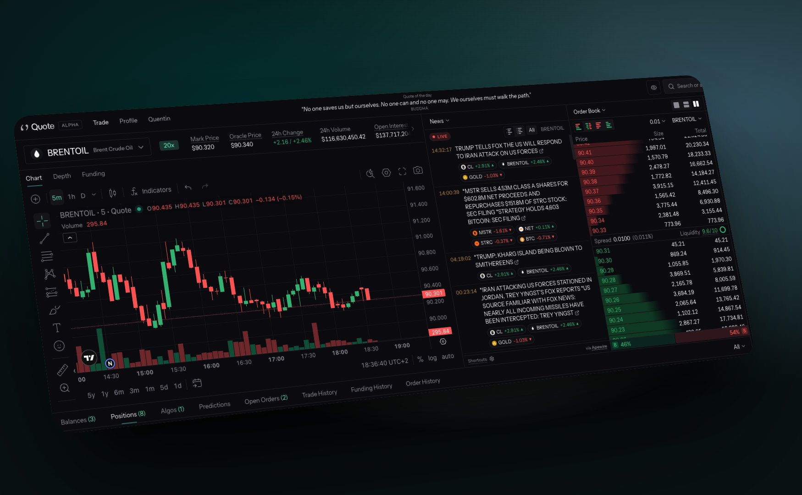

# News

<figure><figcaption></figcaption></figure>

The News tab turns the wire into a trading surface. Headlines stream in from [ApeWire](https://x.com/apewirenews), and every market a headline names carries its own order sizes directly on the card: long or short, one tap, no order ticket to open first. It is the lowest-latency way to trade a headline onchain.

News orders are configured in **Settings > News**. Preferences are saved to this browser, and **Reset to defaults** restores them.

### Quick trading from a headline

Each market named in a headline shows your three quick-trade amounts. Tapping one submits a news order for that size in that market:

* **Long** sizes sit on the left, **short** sizes on the right.
* Unless you skip confirmation, you confirm before the order goes. The confirmation shows the never-exceed price set by your maximum slippage.
* A news order is a normal order once submitted: it is signed by your agent wallet and the venue's usual constraints apply, including minimum notional and price precision. See Hyperliquid Constraints.

## Settings

#### Market controls

Choose how much each headline expands:

* **Open one at a time** shows amounts for a single market per headline. Fewer taps, fewer headlines on screen.
* **Show every market** shows amounts for every market the headline names at once.

#### Quick-trade amounts

The three order sizes offered on a news headline, in USDC. Default: $100 / $1,000 / $10,000.

#### News order type

* **Market** fills immediately, bounded by your maximum slippage. Certainty of fill, at the cost of crossing the spread.
* **Chase** rests at the touch and follows the book, like a Chase Limit order. It earns the spread instead of paying it, and may not fill at all.

#### Skip news order confirmation

When on, quick-trade orders from the News tab submit instantly, without a confirmation step. Pair it with the risk limits below, since there is no review between the tap and the fill.

#### Keyboard trading

Trade the feed without the mouse. Keys work only while the News panel has focus, and every key can be remapped: click a key, press the one you want, Escape cancels. **Reset to defaults** restores the layout.

| Action                        | Keys        |
| ----------------------------- | ----------- |
| Long $100 / $1,000 / $10,000  | `Q` `W` `E` |
| Short $100 / $1,000 / $10,000 | `A` `S` `D` |
| Close the position            | `Shift`+`X` |
| Next / previous headline      | `J` / `K`   |
| Previous / next market        | `←` / `→`   |
| Jump to newest                | `G`         |

### Risk limits

Risk limits only ever block _new_ entries. Closing a position, and adding to a market you already hold, are never blocked.

#### Maximum slippage

The furthest past the current price a news order may fill. This is the never-exceed price shown when you confirm. Default: 5%.

#### Stop news trading on a drawdown

Blocks new news entries once equity falls this far below today's peak: Off, 2%, 5%, or 10%.

#### Open news markets at once

Blocks a news entry into a _new_ market once this many news markets are open: Off, 1, 3, or 5. Adding to a market you already hold is never blocked.

#### Bracket news entries

Attach a take-profit and stop, in percent, to every news entry. Brackets are not attached to a Chase order; switch the news order type to **Market** to use them.
